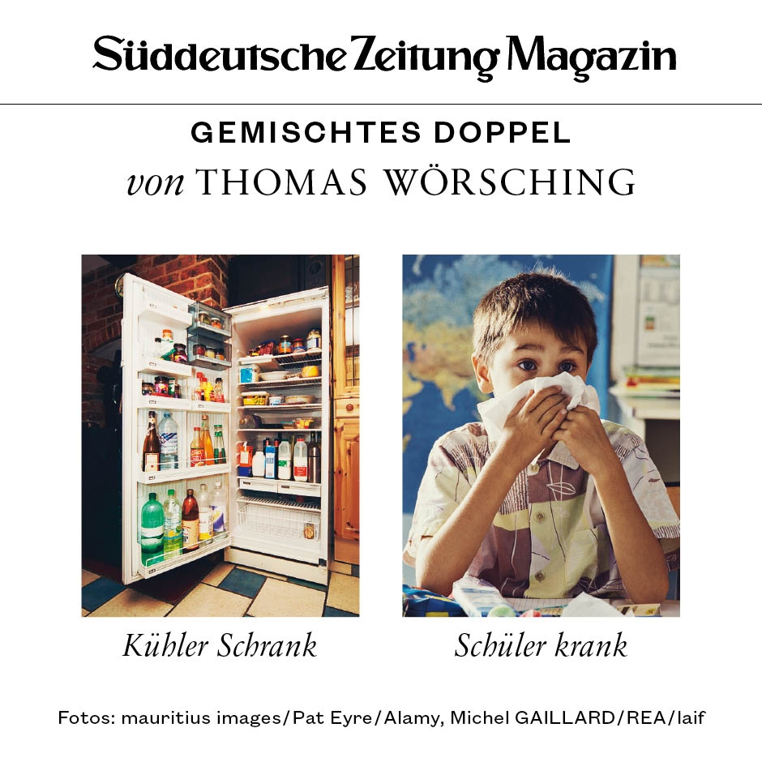
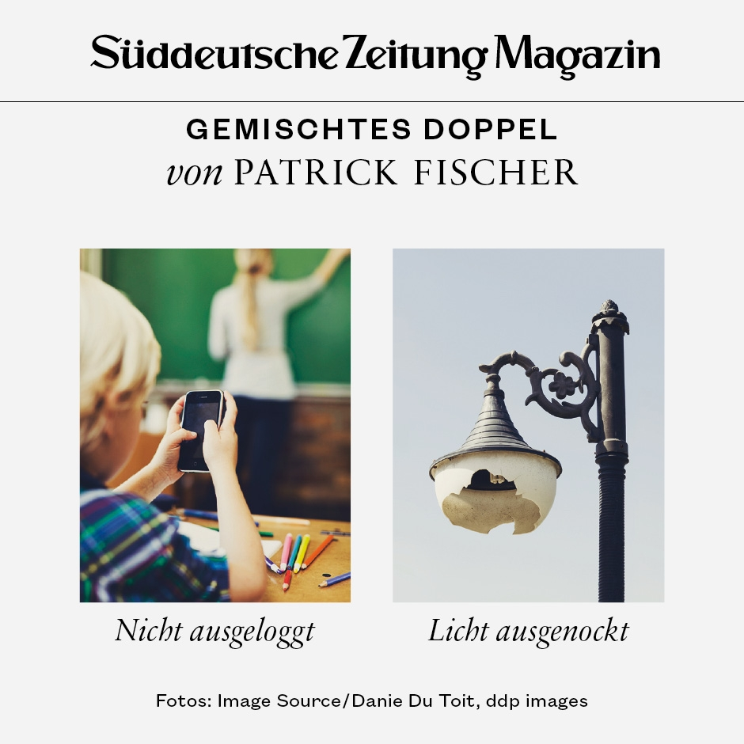
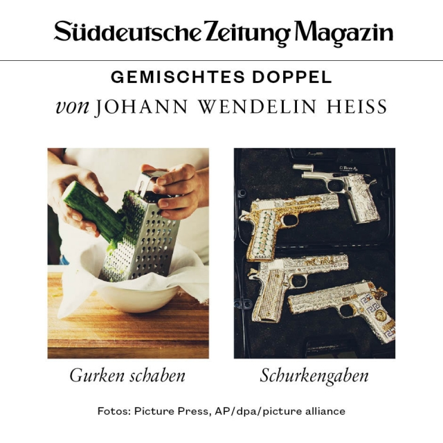

# Assignment 1: Dynamic Programming

## 1. Edit Distances

Implement the [Hamming](https://en.wikipedia.org/wiki/Hamming_distance) and [Levenshtein](https://en.wikipedia.org/wiki/Levenshtein_distance) (edit) distances and compute tem for the for the following word pairs.
It may help to compute them by hand first.







Aside from computing the distance (which is a scalar), do the backtrace and compute the edit transcript (and thus alignment).

Please use [1-3_autocorrect.py](src/1-3_autocorrect.py).

```python
def hamming(s1: str, s2: str) -> int:
    pass
def levenshtein(s1: str, s2: str) -> (int, str):
    pass
```


## 2. Basic Spelling Correction using Edit Distance

For spelling correction, we will use prior knowledge, to put _some_ learning into our system.

The underlying idea is the _Noisy Channel Model_, that is: The user _intends_ to write a word `w`, but through some noise in the process, happens to type the word `x`.

The correct word $\hat{w}$ is that word, that is a valid candidate and has the highest probability:

$$
\begin{eqnarray}
\DeclareMathOperator*{\argmax}{argmax}
\hat{w} & = & \argmax_{w \in V} P(w | x) \\
        & = & \argmax_{w \in V} \frac{P(x|w) P(w)}{P(x)} \\
        & = & \argmax_{w \in V} P(x|w) P(w)
\end{eqnarray}
$$

1. The candidates $V$ can be obtained from a _vocabulary_.
2. The probability $P(w)$ of a word $w$ can be _learned (counted) from data_.
3. The probability $P(x\|w)$ is more complicated... It could be learned from data, but we could also use a _heuristic_ that relates to the edit distance, e.g. rank by distance.

You may use [Peter Norvig's count_1w.txt](http://norvig.com/ngrams/) file, [local mirror](res/count_1w.tar.bz2).
Note that it may help to restrict to the first 10k words to get started.

```python
def suggest(w: str, dist, max_cand=5) -> list:
    pass
```

Please use [1-3_autocorrect.py](src/1-3_autocorrect.py).


### Food for Thought

- How would you modify the implementation so that it works fast for large lexica (eg. the full file above)?
- How would you modify the implementation so that it works "while typing" instead of at the end of a word?
- How do you handle unknown/new words?


## 3. Needleman-Wunsch: Keyboard-aware Auto-Correct

In the parts 1 and 2 above, we applied uniform cost to all substitutions.
This does not really make sense if you look at a keyboard: the QWERTY layout will favor certain substitutions (eg. _a_ and _s_), while others are fairly unlikely (eg. _a_ and _k_).

Implement the [Needleman-Wunsch algorithm](https://en.wikipedia.org/wiki/Needleman–Wunsch_algorithm) which is very similar to the [Levenshtein distance](https://en.wikipedia.org/wiki/Levenshtein_distance), however it doesn't _minimize the cost_ but _maximizes the similarity_.
For a good measure of similarity, implement a metric that computes a meaningful weight for a given character substitution.
How does your `suggest` behave using this metric?

```python
def nw(s1: str, s2: str, d: float, sim) -> float:
    pass
```

Please use [1-3_autocorrect.py](src/1-3_autocorrect.py).

### Food for Thoughts

- What could be better heuristics for similarity resp. cost of substitution than the one above?
- What about capitalization, punctiation and special characters?
- What about swipe-to-type?


## 4. Dynamic Time Warping: Isolated Word Recognition

Due to the relatively large sample number (e.g. 8kHz), performing [DTW](https://en.wikipedia.org/wiki/Dynamic_time_warping) on the raw audio signal is not advised (feel free to try!).
A better solution is to compute a set of features; here we will extract [mel-frequency cepstral coefficients](https://en.wikipedia.org/wiki/Mel-frequency_cepstrum) over windows of 25ms length, shifted by 10ms.
Recommended implementation is [librosa](https://librosa.org/doc/main/generated/librosa.feature.mfcc.html).

Please use [4_iwr.py](src/4_iwr.py).

### Data

Download Zohar Jackson's [free spoken digit dataset](https://github.com/Jakobovski/free-spoken-digit-dataset).
There's no need to clone, feel free to use a revision, like [v1.0.10](https://github.com/Jakobovski/free-spoken-digit-dataset/archive/refs/tags/v1.0.10.tar.gz).
File naming convention is trivial (`{digitLabel}_{speakerName}_{index}.wav`); let's restrict to two speakers, eg. `jackson` and `george`.

### Implement DTW

[DTW](https://en.wikipedia.org/wiki/Dynamic_time_warping) is closely related to [Levenshtein distance](https://en.wikipedia.org/wiki/Levenshtein_distance) and [Needleman-Wunsch algorithm](https://en.wikipedia.org/wiki/Needleman–Wunsch_algorithm).
The main rationale behind DTW is that the two sequences are can be aligned but their speed and exact realization may very.
In consequence, cost is not dependent on an edit operation but on a difference in observations.

To verify your implementation, perform the following Experiment:
For each speaker and digit, select one recording as reference and one as test.

1. Compute the DTW scores between each of the files. 
2. How do the values compare within and across speaker?

```python
def dtw(obs1: list, obs2: list, sim) -> float:
    pass
```

### Implement a DTW-based Isolated Word Recognizer

```python
def recognize(obs: list, refs: dict) -> str:
    """
    obs: input observations (mfcc)
    refs: dict of (classname, observations) as references
    returns classname where distance of observations is minumum
    """
    pass
```

### Discuss your Implementation

- What are inherent issues of this approach?
- How does this algorithm scale with a larger vocabulary, how can it be improved?
- How can you extend this idea to continuous speech, ie. ?


## 5. Decoding States: DTMF

[Dual-tone multi-frequency DTMF](https://en.wikipedia.org/wiki/Dual-tone_multi-frequency_signaling) signaling is an old way of transmitting dial pad keystrokes over the phone.
Each key/symbol is assigned a frequency pair: `[(1,697,1209), (2,697,1336), (3,697,1477), (A,697,1633), (4,770,1209), (5,770,1336), (6,770,1477), (B,770,1633), (7,852,1209), (8,852,1336), (9,852,1477), (C,852,1633), (*,941,1209), (0,941,1336), (#,941,1477), (D,941,1633)]`.
You can generate some DTMF sequences online, eg. <https://www.audiocheck.net/audiocheck_dtmf.php>

For feature computation, use librosa to compute the power spectrum (`librosa.stft` and `librosa.amplitude_to_db`), and extract the approx. band energy for each relevant frequency.

> Note: It's best to identify silence by the overall spectral energy and to normalize the band energies to sum up to one.

To decode DTMF sequences, we can use again dynamic programming, this time applied to states rather than edits.
For DTMF sequences, consider a small, fully connected graph that has 13 states: 0-9, A-D, \*, \# and _silence_.
As for the DP-matrix: the rows will denote the states and the columns represent the time; we will decode left-to-right (ie. time-synchronous), and at each time step, we will have to find the best step forward.
The main difference to edit distances or DTW is, that you may now also "go up" in the table, ie. change state freely.
For distance/similarity, use a template vector for each state that has `.5` for those two bins that need to be active.

When decoding a sequence, the idea is now that we remain in one state as long as the key is pressed; after that, the key may either be released (and the spectral energy is close to 0) hence we're in pause, or another key is pressed, hence it's a "direct" transition.
Thus, from the backtrack, collapse the sequence by digit and remove silence, eg. `44443-3-AAA` becomes `433A`.


```python
def decode(y: np.ndarray, sr: float) -> list:
	"""y is input signal, sr is sample rate; returns list of DTMF-signals (no silence)"""
	pass
```

Please use [5_dtmf.py](src/5_dtmf.py).
